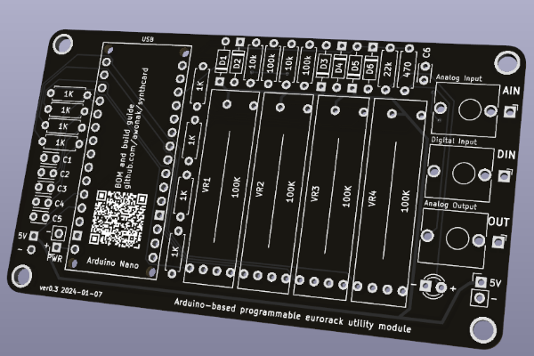
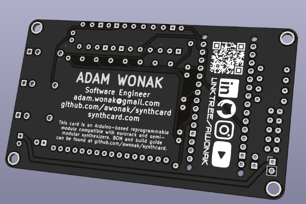
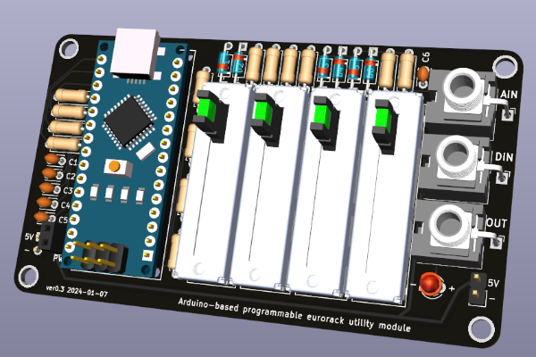

# SynthCard

Synth Card for Adam Wonak

This synthcard is a circuit inspired by [Hagiwo's](https://www.youtube.com/@HAGIWO) SyncLFO and Bezier Curve, and the [Modulove](https://modulove.io/) MVMNT. I chose this design because of the seemingly endless creative firmware scripts I have written for the [Modulove Sync LFO](https://awonak.github.io/HagiwoModulove/synclfo/), so I wanted to make a business card to highlight this circuit design with some fun tweaks.

This is an iteration of the [SynthCard.com](https://synthcard.com) community from [Benjie Jiao](https://github.com/benjiao). 







## Demo Videos

4 Step Sequencer - https://youtu.be/5_vGYVA8IQ8

ADSR - https://youtu.be/wfQtB7HLKf4

## Bill of Materials

To assist with assembly, you can use the interactive [ibom.html page](https://htmlpreview.github.io/?https://github.com/awonak/synthcard/blob/main/hardware/bom/ibom.html) to view a part placement guide.

| Reference(s) | Qty | Value | Supplier Link |
|-|-|-|-|
| C1, C2, C3, C4, C5 | 5 | 0.1uF Capacitor  | https://www.mouser.com/ProductDetail/594-K104M15X7RF53L2 |
| C6 | 1 | 4.7uF Capacitor | https://www.mouser.com/ProductDetail/810-FG14X5R1H475KRT6 |
| D1, D2, D3, D4, D5, D6 | 6 | 1N5817 Schottky Diode | https://www.mouser.com/ProductDetail/833-1N5817-TP |
| D7 | 1 | 3MM LED | https://www.mouser.com/ProductDetail/604-WP3A8ID |
| R1, R2, R3, R4 | 4 | 1K Resistor | https://www.mouser.com/ProductDetail/660-MF1-4DCT52R1001F |
| R11, R12, R13, R14 | 4 | 1K Resistor (LED Brightness) | https://www.mouser.com/ProductDetail/660-MF1-4DCT52R1001F |
| R5, R7 | 2 | 10k Resistor | https://www.mouser.com/ProductDetail/660-MF1-4DCT52R1002F |
| R6, R8 | 2 | 100k Resistor | https://www.mouser.com/ProductDetail/660-MF1-4D52R1003F |
| R9 | 1 | 22k Resistor | https://www.mouser.com/ProductDetail/660-MF1-4DCT52R2202F |
| R10 | 1 | 470 Resistor | https://www.mouser.com/ProductDetail/660-MF1-4DCT52R4700F |
| VR1, VR2, VR3, VR4 | 4 | 20MM Slide Potentiometer 100K | https://www.mouser.com/ProductDetail/652-PTL20-15R0-104B1 |
| J3, J4, J5 | 1 | Thonkiconn 3.5mm Mono Jack | https://www.thonk.co.uk/shop/thonkiconn/ |
| A1 | 1 | Arduino Nano | [https://www.amazon.com/...](https://www.amazon.com/LAFVIN-Board-ATmega328P-Micro-Controller-Arduino/dp/B07G99NNXL/ref=sr_1_1_sspa?crid=110SU9VW3VQB6&keywords=arduino+nano&qid=1703001737&sprefix=arduino+nano%2Caps%2C117&sr=8-1-spons&sp_csd=d2lkZ2V0TmFtZT1zcF9hdGY&psc=1) |

## Pinout

| Arduino Pin | Function |
|-|-|
| A0 | Slider 1 Input |
| A1 | Slider 2 Input |
| A2 | Slider 3 Input |
| A3 | Slider 4 Input |
| A7 | Analog Input |
| D3 | Slider 4 LED |
| D5 | Slider 3 LED |
| D6 | Slider 2 LED |
| D9 | Slider 1 LED |
| D10 | Digital Output |
| D11 | Digital Input |

## Code Example

The most basic program we can write for the Synth Card is a Blink program. Using the pin guide above, we can see the digital output is `D10` which has an LED connected to the circuit. We can use this pin to blink the LED. 

```cpp
#define CV_OUT 10  // CV Output with LED

void setup() {
  pinMode(CV_OUT, OUTPUT);
}

void loop() {
  digitalWrite(CV_OUT, HIGH);
  delay(500);
  digitalWrite(CV_OUT, LOW);
  delay(500);
}
```

To test out all of the inputs, outputs, and LEDs, you can flash the [HardwareTest](firmware/HardwareTest/HardwareTest.ino) script.

To see additional example firmware scripts, head over to [firmware](firmware/).

## Hardware Revision History

| Revision | Date | Notes
|-|-|-|
| ver0.3 | 2024-01-07 | - Change: minor silkscreen updates<br> - Change: made 5v trace larger
| ver0.2 | 2023-12-28 | - Fix: CV Output circuit was backwards<br> - Change: Rename capacitor footprint values<br> - Change: Improved LED footprint values<br> - Change: Add linktr.ee and social logos 
| ver0.1 | 2023-12-18 | Initial release

## Enclosure

[OnShape 3D printer enclosure design](https://cad.onshape.com/documents/56a3cdf5a05401551b0a6543/v/da0e57abf21331cdf97fa6e6/e/f128ee10c6516a251dc2fe2a)


## Buy a SynthCard Kit

<a href="https://www.tindie.com/stores/awonak/?ref=offsite_badges&utm_source=sellers_awonak&utm_medium=badges&utm_campaign=badge_large"></a>
