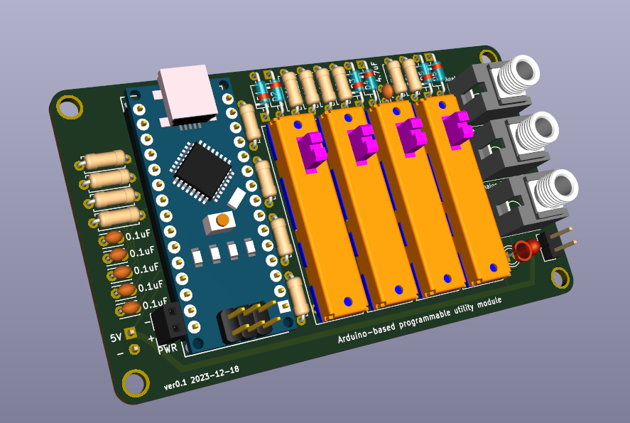

# synthcard
Synth Card for Adam Wonak

This synthcard is a circuit inspired by [Hagiwo's](https://www.youtube.com/@HAGIWO) SyncLFO and Bezier Curve, and the [Modulove](https://modulove.io/) Sync LFO. I chose this design because of the seemingly endless creative firmware scripts I have written for the [Modulove Sync LFO](https://awonak.github.io/HagiwoModulove/synclfo/), so I wanted to make a business card to highlight this circuit design with some fun tweaks.

This is an iteration of the SynthCard.com community from [Benjie Jiao](https://github.com/benjiao). 

# Bill of Materials

To assist with assembly, you can use the interactive [ibom.html page](https://htmlpreview.github.io/?https://github.com/awonak/synthcard/blob/main/sc_awonak/bom/ibom.html) to view a part placement guide.

| Reference(s) | Qty | Value | Supplier Link |
|-|-|-|-|
| C1, C2, C3, C4, C5 | 5 | 0.1uF Capacitor  | https://www.mouser.com/ProductDetail/594-K104M15X7RF53L2 |
| C6 | 1 | 4.7uF Capacitor | https://www.mouser.com/ProductDetail/810-FG14X5R1H475KRT6 |
| D1, D2, D3, D4, D5, D6 | 6 | BAT43 Schottky Diode | https://www.mouser.com/ProductDetail/511-BAT43 |
| D7 | 1 | 3MM LED | https://www.mouser.com/ProductDetail/604-WP3A8ID |
| R1, R2, R3, R4 | 4 | 1K Resistor | https://www.mouser.com/ProductDetail/660-MF1-4DCT52R1001F |
| R11, R12, R13, R14 | 4 | 1K Resistor (LED Brightness) | https://www.mouser.com/ProductDetail/660-MF1-4DCT52R1001F |
| R5, R7 | 2 | 10k Resistor | https://www.mouser.com/ProductDetail/660-MF1-4DCT52R1002F |
| R6, R8 | 2 | 100k Resistor | https://www.mouser.com/ProductDetail/660-MF1-4D52R1003F |
| R9 | 1 | 22k Resistor | https://www.mouser.com/ProductDetail/660-MF1-4DCT52R2202F |
| R10 | 1 | 470 Resistor | https://www.mouser.com/ProductDetail/660-MF1-4DCT52R4700F |
| VR1, VR2, VR3, VR4 | 4 | 20MM Slide Potentiometer 100K | https://www.mouser.com/ProductDetail/652-PTL20-15R0-104B1 |
| J3, J4, J5 | 1 | Thonkiconn 3.5mm Mono Jack | https://www.thonk.co.uk/shop/thonkiconn/ |
| A1 | 1 | Arduino Nano | [https://www.amazon.com/](https://www.amazon.com/LAFVIN-Board-ATmega328P-Micro-Controller-Arduino/dp/B07G99NNXL/ref=sr_1_1_sspa?crid=110SU9VW3VQB6&keywords=arduino+nano&qid=1703001737&sprefix=arduino+nano%2Caps%2C117&sr=8-1-spons&sp_csd=d2lkZ2V0TmFtZT1zcF9hdGY&psc=1) |

# Pinout

| Arduino Pin | Function |
|-|-|
| A0 | Slider 1 Input |
| A1 | Slider 2 Input |
| A2 | Slider 3 Input |
| A3 | Slider 4 Input |
| A7 | Analog Input |
| D3 | Slider 4 LED |
| D5 | Slider 3 LED |
| D6 | Slider 2 LED |
| D9 | Slider 1 LED |
| D10 | Digital Input |
| D11 | Digital Output |
