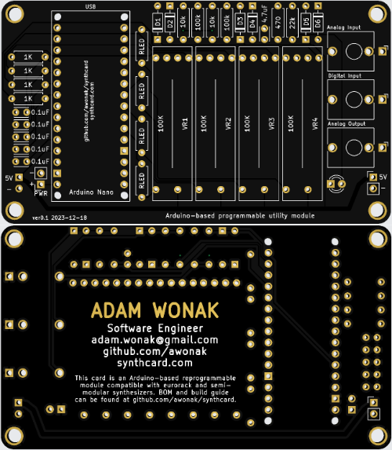

# synthcard
Synth Card for Adam Wonak

This synthcard is a circuit inspired by [Hagiwo's](https://www.youtube.com/@HAGIWO) SyncLFO and Bezier Curve, and the [Modulove](https://modulove.io/) Sync LFO. I chose this design because of the seemingly endless creative firmware scripts I have written for the [Modulove Sync LFO](https://awonak.github.io/HagiwoModulove/synclfo/), so I wanted to make a business card to highlight this circuit design with some fun tweaks.

This is an iteration of the SynthCard.com community from [Benjie Jiao](https://github.com/benjiao). 

# Bill of Materials

| Reference(s) | Qty | Value | Supplier Link |
|-|-|-|-|
| A1 | 1 | Arduino Nano | https://www.amazon.com/ |LAFVIN-Board-ATmega328P-Micro-Controller-Arduino/dp/B07G99NNXL
| C1, C2, C3, C4, C5 | 5 | 0.1uF | https://www.mouser.com/ProductDetail/594-K104M15X7RF53L2 |
| C6 | 1 | 4.7uF | https://www.mouser.com/ProductDetail/810-FG14X5R1H475KRT6 |
| D1, D2, D3, D4, D5, D6 | 6 | BAT43 | https://www.mouser.com/ProductDetail/511-BAT43 |
| D7 | 1 | 3MM LED | https://www.mouser.com/ProductDetail/604-WP3A8ID |
| J3, J4, J5 | 1 | 3.5MM Jack | https://www.thonk.co.uk/shop/thonkiconn/ |
| R1, R2, R3, R4 | 4 | 1K | https://www.mouser.com/ProductDetail/660-MF1-4DCVTR1001F |
| R5, R7 | 2 | 10k | https://www.mouser.com/ProductDetail/660-MF1-4DCVTR1002F |
| R6, R8 | 2 | 100k | https://www.mouser.com/ProductDetail/660-MF1-4CCT52R1003F |
| R9 | 1 | 22k | https://www.mouser.com/ProductDetail/660-MF1-4DCT52R2202F |
| R10 | 1 | 470 | https://www.mouser.com/ProductDetail/660-MF1-4CCT52R4700F |
| R11, R12, R13, R14 | 4 | 1K-2K (LED Resistor) | https://www.mouser.com/ProductDetail/660-MF1-4DCVTR1001F |
| VR1, VR2, VR3, VR4 | 4 | 20MM Slide Pot 100K | https://www.mouser.com/ProductDetail/652-PTL20-15R0-104B1 |